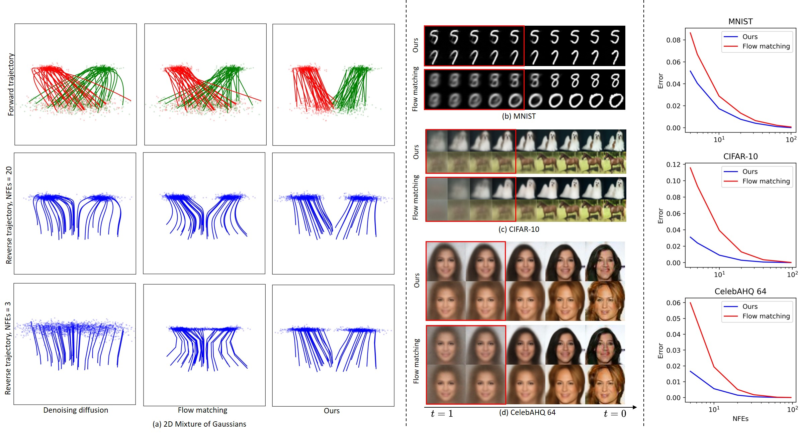

# Fast-ODE

This is the codebase for our paper Minimizing Trajectory Curvature of ODE-based Generative Models (ICML 2023).



> **Minimizing Trajectory Curvature of ODE-based Generative Models**<br>
> Sangyun Lee<sup>1</sup>, Beomsu Kim<sup>2</sup>, ‪Jong Chul Ye<sup>2</sup>

> <sup>1</sup>Soongsil University, <sup>2</sup>KAIST

> Paper: https://arxiv.org/abs/2301.12003<br>

> **Abstract:** *Recent ODE/SDE-based generative models, such as diffusion models, rectified flows, and flow matching, define a generative process as a time reversal of a fixed forward process. Even though these models show impressive performance on large-scale datasets, numerical simulation requires multiple evaluations of a neural network, leading to a slow sampling speed. We attribute the reason to the high curvature of the learned generative trajectories, as it is directly related to the truncation error of a numerical solver. Based on the relationship between the forward process and the curvature, here we present an efficient method of training the forward process to minimize the curvature of generative trajectories without any ODE/SDE simulation. Experiments show that our method achieves a lower curvature than previous models and, therefore, decreased sampling costs while maintaining competitive performance.*

## Usage
`train_reverse_2d_joint.py`: Training code for two mode Gaussian example.

`train_reverse_img_ddp`: Training code for image data.

`generate.py`: Generate images.

`fid.py`: Calculate FID score.

### Train CIFAR-10
```python
 python train_reverse_img_ddp.py --gpu 0,1 --dir ./runs/cifar10-beta20/ --weight_prior 20 --learning_rate 2e-4 --dataset cifar10 --warmup_steps 5000 --optimizer adam --batchsize 128 --iterations 500000 --config_en configs\cifar10_en.json --config_de configs\cifar10_de.json
 ```

### Train MNIST
```python
 python train_reverse_img_ddp.py --gpu 0,1 --dir ./runs/mnist-beta20/ --weight_prior 20 --learning_rate 3e-4 --dataset mnist --warmup_steps 8000 --optimizer adam --batchsize 256 --iterations 60000 --config_en configs\mnist_en.json --config_de configs\mnist_de.json
 ```

### Train FFHQ 64
```python
python train_reverse_img_ddp.py --gpu 0,1,2,3,4,5,6,7 --dir runs/ffhq-beta20 --weight_prior 20 --learning_rate 2e-4 --dataset ffhq --warmup_steps 39060 --batchsize 256 --iterations 800000 --config_en configs/ffhq_en.json --config_de configs/ffhq_de.json
```

### MNIST distillation
```python
 python distill.py --gpu 0 --config_de ./configs/mnist_de.json --dir test --im_dir C:\ML\learned-flow\mnist-learned-beta5\60000-N128-num100K\samples --im_dir_test C:\ML\learned-flow\mnist-learned-beta5\60000-N128-num100K\samples_test --z_dir C:\ML\learned-flow\mnist-learned-beta5\60000-N128-num100K\zs --z_dir_test C:\ML\learned-flow\mnist-learned-beta5\60000-N128-num100K\zs_test --batchsize 256 --ckpt D:\ML\learned-flows\runs\reverse\mnist-learned-beta5\flow_model_60000_ema.pth 
 ```

### Generate MNIST
```python
 python generate.py --gpu 0 --dir test --N 100 --res 28 --input_nc 1 --num_samples 10 --ckpt D:\ML\learned-flows\runs\reverse\mnist-learned-beta20\flow_model_60000_ema.pth --config_de configs\mnist_de.json 
 ```

### Generate FFHQ 64 while saving trajectories
```python
python generate.py --gpu 0,1,2,3,4,5,6,7 --dir runs/ffhq-independent/200000-heun-N121/ --solver heun --N 121 --res 64 --input_nc 3 --num_samples 100 --ckpt runs/ffhq-independent/flow_model_200000_ema.pth --config_de configs/ffhq_de.json --batchsize 128 --save_traj;
```


### Calcuate FID on cifar10
```python
python fid.py calc --images=runs\reverse\cifar10-learned-beta10-smallE\300000-N128\samples --ref=https://nvlabs-fi-cdn.nvidia.com/edm/fid-refs/cifar10-32x32.npz
```

CIFAR-10 training roughly takes 9 days on 2x1080Ti.


## Pre-trained models and configurations
AFHQ 64: [link](https://drive.google.com/drive/folders/1PBeBhC0onqQ2L96_OBR6PxQlBf9A5HSA?usp=share_link)

FFHQ 64: [link](https://drive.google.com/drive/folders/1RMpVSUWXKctN1_XPSkzuDfQ7GqSK5bj3?usp=share_link)

CIFAR-10: [link](https://drive.google.com/drive/folders/1LsUlk94ljqWKh4kX9w8g0cseVmsV_x83?usp=share_link) 

Inception feature statistics (required for computing FID score): [link](https://drive.google.com/drive/folders/1MCEAn0VdeD-lMu1Cdkm9z7q-CdzH1JDc?usp=share_link)
## Environment
Tested environment: PyTorch 1.12.0 / 1.11.0, Python 3.8.5, Windows 10, CUDA 10.1

## Acknowledgement
We borrow some codes from the implementations of
- https://arxiv.org/abs/2206.00364
- https://arxiv.org/abs/2209.03003
- https://arxiv.org/abs/2105.05233

. We thank the authors for their great work.

## Citation

If you find this work useful for your research, please cite our paper:

```bibtex
@article{lee2023minimizing,
  title={Minimizing Trajectory Curvature of ODE-based Generative Models},
  author={Lee, Sangyun and Kim, Beomsu and Ye, Jong Chul},
  journal={arXiv preprint arXiv:2301.12003},
  year={2023}
}
```
